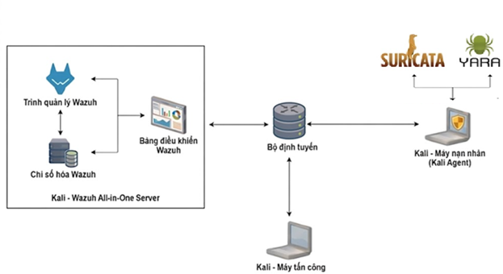

# Nghiên cứu Xây dựng Giải pháp Giám sát An ninh Tập trung (SIEM) dựa trên Nền tảng Wazuh
 
Dự án này tập trung vào việc nghiên cứu kiến trúc, nguyên lý hoạt động và triển khai thực tế hệ thống Giám sát An ninh Tập trung (SIEM) sử dụng nền tảng mã nguồn mở Wazuh. Đồng thời, hệ thống được mở rộng năng lực giám sát thông qua việc tích hợp các công cụ bảo mật chuyên dụng bao gồm Suricata (NIDS) và YARA (Malware Detection) nhằm hình thành cơ chế phòng thủ chuyên nghiệp, phát hiện sớm và phản ứng nhanh trước các sự cố an ninh mạng.
 
---
 
## 1. Tổng quan về Wazuh (Overview)
 
Wazuh là một nền tảng bảo mật mã nguồn mở và miễn phí, tích hợp toàn diện các tính năng của **EDR (Endpoint Detection and Response)** và **SIEM (Security Information and Event Management)**. Hệ thống hỗ trợ bảo vệ đa môi trường từ on-premise, ảo hóa, container cho đến điện toán đám mây.
 
Wazuh cung cấp các cơ chế phòng thủ mạnh mẽ giúp phát hiện và ngăn chặn các hành vi tấn công phổ biến như: dò tìm lỗ hổng (Vulnerability scanning), tấn công từ chối dịch vụ (DoS), tấn công dò đoán mật khẩu (Brute-force) hay các hành vi khai thác tràn bộ đệm.
 
---
 
## 2. Kiến trúc & Các thành phần cốt lõi (Architecture)
 
Kiến trúc của Wazuh hoạt động theo mô hình **Agent - Manager**, trong đó các Agent cài đặt tại máy chủ đích sẽ thu thập và chuyển tiếp log một cách an toàn về máy chủ quản lý trung tâm (Wazuh Server) để xử lý tập trung.
 
### 2.1. Thành phần hệ thống
 
Hệ thống bao gồm 4 thành phần lõi phối hợp chặt chẽ với nhau:
 
- **Wazuh Indexer:** Công cụ phân tích và tìm kiếm toàn văn (full-text search) có hiệu năng cao, chịu trách nhiệm lập chỉ mục và lưu trữ dữ liệu cảnh báo dưới định dạng JSON. Sử dụng các chỉ mục chuyên biệt: `wazuh-alerts`, `wazuh-archives`, `wazuh-monitoring`, và `wazuh-statistic`.
- **Wazuh Agent:** Phần mềm gọn nhẹ cài đặt trên các endpoint (Linux, Windows, macOS, Cloud...) để thu thập dữ liệu nhật ký, giám sát cấu hình hệ thống, kiểm tra tính toàn vẹn tệp và thực thi các lệnh phản hồi.
- **Wazuh Server:** Trung tâm xử lý logic chứa **Analysis Engine** để giải mã log (Decoding) và đối sánh bộ quy tắc (Rule matching) để phát hiện mối đe dọa. Thành phần này tích hợp *Wazuh RESTful API*, *Wazuh Cluster Daemon* (hỗ trợ scale cụm Multi-node) và *Filebeat* để đẩy dữ liệu sang Indexer.
- **Wazuh Dashboard:** Giao diện Web trực quan (UI) giúp quản trị viên SOC theo dõi, truy vấn nâng cao, phân tích biểu đồ log và quản lý tập trung trạng thái của toàn bộ hệ thống Agent.
### 2.2. Mô hình triển khai
 
Để khai thác hiệu quả các chức năng của Wazuh, mô hình sẽ bao gồm hai thành phần chính: Wazuh Server và Wazuh Agent. Trong đó, Wazuh Server đóng vai trò duy trì một giao diện web để quản lý và giám sát, đồng thời thu thập và phân tích dữ liệu từ các agent. Wazuh Agent được cài đặt trên các máy chủ hoặc thiết bị cần giám sát, gửi dữ liệu về cho Wazuh Server để xử lý và hiển thị thông tin chi tiết về an ninh mạng.
 
Dưới đây là mô hình hệ thống triển khai theo kịch bản đã xây dựng.
            
 
Phạm vi giám sát: Mô hình giám sát được triển khai nhằm theo dõi hoạt động trên endpoint Linux. Suricata NIDS được sử dụng để phát hiện xâm nhập mạng, trong khi Yara giám sát các hoạt động độc hại trên endpoint Linux. Các hoạt động đó được giám sát thông qua Wazuh Server. Endpoint Linux là mục tiêu của tấn công SSH brute-force từ máy tấn công Kali Linux. Mô hình tích hợp các công cụ nhằm đảm bảo khả năng giám sát, phát hiện và phản ứng nhanh với các mối đe dọa an ninh mạng.
 
---
 
## 3. Các tính năng an ninh nổi bật (Key Features)
 
-  **Phân tích log và phát hiện mối đe dọa:** Tự động thu thập log từ hệ điều hành, ứng dụng, thiết bị mạng (qua Syslog cổng tùy chỉnh như TCP/UDP). Log thô sau đó được giải mã, trích xuất trường thông tin (IP, Username, Event ID...) và đối sánh luật để đưa ra cảnh báo thời gian thực.
-  **Giám sát toàn vẹn tệp tin (FIM):** Định kỳ quét và tính toán mã băm (checksum SHA1) của các tệp tin hệ thống và khóa Windows Registry. Cơ chế đồng bộ hóa giữa Agent và Manager giúp phát hiện ngay lập tức các hành vi sửa đổi thuộc tính, thay đổi quyền, tạo mới hoặc xóa tệp tin đáng ngờ mà hoàn toàn không gây ảnh hưởng đến hiệu năng hay an toàn thông tin của endpoint.
-  **Phản hồi chủ động (Active Response):** Tự động kích hoạt các kịch bản ứng phó sự cố (Scripts) được cấu hình sẵn trên Agent dưới dạng *Stateful* (có thời gian hoàn tác, ví dụ: chặn IP bằng tường lửa trong 30 phút) hoặc *Stateless* (hành động một lần như cô lập tiến trình, xóa file độc hại).
-  **Phát hiện lỗ hổng bảo mật:** Mô-đun `vulnerability-detector` liên tục thu thập danh sách phần mềm cài đặt trên endpoint, đối chiếu trực tiếp với kho dữ liệu Cyber Threat Intelligence (Cơ sở dữ liệu CVE từ NVD, Canonical, RedHat...) để phát hiện sớm các phần mềm tồn tại lỗi bảo mật.
-  **Đánh giá cấu hình bảo mật (SCA):** Rà quét và đánh giá cấu hình hệ thống dựa trên các bảng danh sách kiểm tra của tiêu chuẩn quốc tế **CIS (Center for Internet Security)** nhằm phát hiện lỗi cấu hình sai, mật khẩu yếu hoặc các lỗ hổng hệ thống.
-  **Phát hiện mã độc (Rootcheck):** Quét sâu hệ thống để phát hiện các dấu hiệu bất thường cấp hạt nhân của Rootkit thông qua kiểm tra tiến trình ẩn, tệp tin bị che giấu, cổng mạng bất thường và các tệp có quyền ghi suid nguy hiểm.
---
 
## 4. Giải pháp tích hợp hệ thống mở rộng (Integrations)
 
Để tối ưu hóa năng lực giám sát và xây dựng mô hình SOC hoàn chỉnh, hệ thống hỗ trợ tích hợp linh hoạt với các công cụ bảo mật hàng đầu:
 
- **Suricata (NIDS/NIPS):** Hệ thống phát hiện xâm nhập mạng sâu. Đóng vai trò phân tích lưu lượng mạng, phát hiện tấn công mạng (như SQL Injection, DoS) và chuyển tiếp log cảnh báo về bộ lọc của Wazuh Manager.
- **YARA:** Công cụ phát hiện mã độc dựa trên tập luật (Ruleset). Wazuh gọi YARA để quét các file trên hệ thống endpoint nhằm phát hiện và cảnh báo kịp thời sự hiện diện của mã độc hoặc các chuỗi nhị phân khả nghi.
- **Snort:** Tích hợp bộ quy tắc phát hiện xâm nhập mạng dựa trên chữ ký (Signature-based detection) để làm phong phú nguồn log an ninh mạng.
- **Splunk:** Chuyển tiếp các sự kiện và cảnh báo chất lượng cao từ Wazuh lên nền tảng SIEM thương mại Splunk để phục vụ phân tích chuyên sâu, tạo báo cáo tuân thủ và trực quan hóa nâng cao.
- **Shuffle (SOAR):** Kết nối cảnh báo từ Wazuh đến quy trình tự động hóa SOAR để tự động hóa hoàn toàn các chuỗi phản ứng sự cố, tạo ticket xử lý hoặc cách ly máy trạm tự động.
---
 
## 5. Hướng dẫn triển khai, cài đặt và tích hợp (Installation Guide)
 
### 5.1. Cài đặt
 
#### 5.1.1. Cài đặt Wazuh-Manager trên máy Kali-server
 
**a) Cài đặt Wazuh Indexer**
 
Khởi động máy kali, chạy với quyền root:
 
```bash
# Tải xuống trình trợ giúp cài đặt Wazuh và tệp cấu hình
curl -sO https://packages.wazuh.com/4.14/wazuh-install.sh
curl -sO https://packages.wazuh.com/4.14/config.yml
```
 
```yaml
# Chỉnh sửa ./config.yml và thay thế tên nút và giá trị IP bằng tên và địa chỉ IP tương ứng
# Wazuh indexer nodes
indexer:
  - name: node-1
    ip: "<indexer-node-ip>"
  #- name: node-2
  #  ip: "<indexer-node-ip>"
  #- name: node-3
  #  ip: "<indexer-node-ip>"
 
# Wazuh server nodes
# If there is more than one Wazuh server node, each one must have a node_type
server:
  - name: wazuh-1
    ip: "<wazuh-manager-ip>"
  #  node_type: master
  #- name: wazuh-2
  #  ip: "<wazuh-manager-ip>"
  #  node_type: worker
  #- name: wazuh-3
  #  ip: "<wazuh-manager-ip>"
  #  node_type: worker
 
# Wazuh dashboard nodes
dashboard:
  - name: dashboard
    ip: "<dashboard-node-ip>"
```
 
```bash
# Chạy trình trợ giúp cài đặt Wazuh với tùy chọn --generate-config-files
# tạo khóa cụm Wazuh, chứng chỉ và mật khẩu cần thiết cho quá trình cài đặt
bash wazuh-install.sh --generate-config-files
```
 
```bash
# Chạy trình trợ giúp cài đặt Wazuh với tùy chọn --wazuh-indexer
# và tên nút để cài đặt và cấu hình trình lập chỉ mục Wazuh
bash wazuh-install.sh --wazuh-indexer node-1
```
 
```bash
# Chạy trình trợ giúp cài đặt Wazuh với tùy chọn --start-cluster
# trên bất kỳ nút lập chỉ mục Wazuh nào để tải thông tin chứng chỉ mới và khởi động cụm
bash wazuh-install.sh --start-cluster
```
 
```bash
# Chạy lệnh sau để lấy mật khẩu quản trị
tar -axf wazuh-install-files.tar wazuh-install-files/wazuh-passwords.txt -O | grep -P "\'admin\'" -A 1
```
 
```bash
# Chạy lệnh sau để xác nhận quá trình cài đặt thành công
# Thay thế <WAZUH_INDEXER_IP_ADDRESS> bằng địa chỉ IP của trình lập chỉ mục Wazuh
# và sử dụng mật khẩu nhận được từ kết quả của lệnh trước đó
curl -k -u admin https://<WAZUH_INDEXER_IP_ADDRESS>:9200
```
 
```bash
# Chạy lệnh sau để kiểm tra xem cụm máy chủ có hoạt động chính xác hay không
# Thay thế <WAZUH_INDEXER_IP_ADDRESS> bằng địa chỉ IP của trình lập chỉ mục Wazuh
# và nhập mật khẩu cho admin người dùng trình lập chỉ mục Wazuh khi được yêu cầu
curl -k -u admin https://<WAZUH_INDEXER_IP_ADDRESS>:9200/_cat/nodes?v
```
 
**b) Cài đặt Wazuh Server**
 
Khởi động máy kali, chạy với quyền root:
 
```bash
# Chạy trình trợ giúp cài đặt Wazuh với tùy chọn --wazuh-server
# theo sau là tên nút để cài đặt máy chủ Wazuh
bash wazuh-install.sh --wazuh-server wazuh-1
```
 
**c) Cài đặt Wazuh Dashboard**
 
Khởi động máy kali, chạy với quyền root:
 
```bash
# Chạy trình trợ giúp cài đặt Wazuh với tùy chọn --wazuh-dashboard
# và tên nút để cài đặt và cấu hình bảng điều khiển Wazuh
bash wazuh-install.sh --wazuh-dashboard dashboard
```
 
```bash
# Tắt cập nhật Wazuh
sed -i "s/^deb /#deb /" /etc/apt/sources.list.d/wazuh.list
apt update
```
 
#### 5.1.2. Cài đặt Wazuh Agent trên máy Kali-client
 
Khởi động máy kali, chạy với quyền root:
 
```bash
# Thêm kho lưu trữ Wazuh
 
# Cài đặt thêm các gói
apt-get install gnupg apt-transport-https
 
# Cài đặt khóa GPG
curl -s https://packages.wazuh.com/key/GPG-KEY-WAZUH | gpg --no-default-keyring \
  --keyring gnupg-ring:/usr/share/keyrings/wazuh.gpg --import \
  && chmod 644 /usr/share/keyrings/wazuh.gpg
 
# Thêm kho lưu trữ
echo "deb [signed-by=/usr/share/keyrings/wazuh.gpg] https://packages.wazuh.com/4.x/apt/ stable main" \
  | tee -a /etc/apt/sources.list.d/wazuh.list
 
# Cập nhật thông tin gói
apt-get update
```
 
```bash
# Triển khai Wazuh Agent
# Thay thế giá trị WAZUH_MANAGER bằng địa chỉ IP hoặc tên máy chủ của trình quản lý Wazuh
WAZUH_MANAGER="10.0.0.2" apt-get install wazuh-agent
```
 
```bash
# Kích hoạt và khởi động dịch vụ Wazuh agent
systemctl daemon-reload
systemctl enable wazuh-agent
systemctl start wazuh-agent
```
 
```bash
# Tắt cập nhật Wazuh
sed -i "s/^deb/#deb/" /etc/apt/sources.list.d/wazuh.list
apt-get update
```
 
#### 5.1.3. Cài đặt và tích hợp Suricata trên Wazuh
 
Khởi động máy wazuh-agent, mở terminal để tải Suricata:
 
```bash
sudo apt update && sudo apt install suricata -y
```
 
Chỉnh sửa cài đặt Suricata trong tệp `/etc/suricata/suricata.yaml`:
 
```yaml
vars:
  address-groups:
    HOME_NET: "[192.168.111.150]"
    EXTERNAL_NET: "any"
```
 
Sau khi chỉnh sửa tệp `/etc/suricata/suricata.yaml` xong, lưu và thoát để khởi động lại Suricata:
 
```bash
sudo systemctl restart suricata
```
 
Cấu hình Wazuh Agent đọc log của Suricata - mở file cấu hình của Wazuh agent:
 
```bash
sudo nano /var/ossec/etc/ossec.conf
```
 
Thêm cấu hình cho phép Wazuh agent đọc logs file của Suricata:
 
```xml
<localfile>
  <log_format>json</log_format>
  <location>/var/log/suricata/eve.json</location>
</localfile>
```
 
Gán quyền cho Suricata quản lý thư mục log:
 
```bash
sudo chmod 755 /var/log/suricata
sudo chmod 644 /var/log/suricata/eve.json
```
 
Khởi động lại Wazuh agent để nhận cấu hình mới:
 
```bash
sudo systemctl restart wazuh-agent
```
 
#### 5.1.4. Cài đặt và tích hợp YARA trên Wazuh
 
Ở máy wazuh-agent, mở terminal để cài đặt môi trường YARA:
 
```bash
sudo apt update
sudo apt install -y make gcc autoconf libtool libssl-dev pkg-config jq curl
```
 
Tải phiên bản mã nguồn chính thức của YARA, giải nén và tiến hành biên dịch trực tiếp trên wazuh-agent:
 
```bash
sudo curl -LO https://github.com/VirusTotal/yara/archive/v4.5.5.tar.gz
sudo tar -xvzf v4.5.5.tar.gz -C /usr/local/bin/ && rm -f v4.5.5.tar.gz
cd /usr/local/bin/yara-4.5.5/
 
# Khởi tạo và cấu hình biên dịch
sudo ./bootstrap.sh
sudo ./configure
sudo make
sudo make install
```
 
Tải bộ luật mẫu (rules) của YARA:
 
```bash
sudo mkdir -p /tmp/yara/rules
sudo curl 'https://valhalla.nextron-systems.com/api/v1/get' \
  -H 'Content-Type: application/x-www-form-urlencoded' \
  --data 'demo=demo&apikey=1111111111111111111111111111111111111111111111111111111111111111&format=text' \
  -o /tmp/yara/rules/yara_rules.yar
```
 
Mở một file script mới trong thư mục của Wazuh:
 
```bash
sudo nano /var/ossec/active-response/bin/yara.sh
```
 
Viết script vào file vừa tạo:
 
```bash
#!/bin/bash
# Wazuh - Yara active response
# Copyright (C) 2015-2022, Wazuh Inc.
#
# This program is free software; you can redistribute it
# and/or modify it under the terms of the GNU General Public
# License (version 2) as published by the FSF - Free Software
# Foundation.
 
#------------------------- Gather parameters -------------------------#
# Extra arguments
read INPUT_JSON
YARA_PATH=$(echo $INPUT_JSON | jq -r .parameters.extra_args[1])
YARA_RULES=$(echo $INPUT_JSON | jq -r .parameters.extra_args[3])
FILENAME=$(echo $INPUT_JSON | jq -r .parameters.alert.syscheck.path)
 
# Set LOG_FILE path
LOG_FILE="logs/active-responses.log"
 
size=0
actual_size=$(stat -c %s ${FILENAME})
while [ ${size} -ne ${actual_size} ]; do
  sleep 1
  size=${actual_size}
  actual_size=$(stat -c %s ${FILENAME})
done
 
#----------------------- Analyze parameters -----------------------#
if [[ ! $YARA_PATH ]] || [[ ! $YARA_RULES ]]
then
    echo "wazuh-yara: ERROR - Yara active response error. Yara path and rules parameters are mandatory." >> ${LOG_FILE}
    exit 1
fi
 
#------------------------- Main workflow --------------------------#
# Execute Yara scan on the specified filename
yara_output="$("${YARA_PATH}"/yara -w -r "$YARA_RULES" "$FILENAME")"
 
if [[ $yara_output != "" ]]
then
    # Iterate every detected rule and append it to the LOG_FILE
    while read -r line; do
        echo "wazuh-yara: INFO - Scan result: $line" >> ${LOG_FILE}
    done <<< "$yara_output"
fi
 
exit 0;
```
 
Phân quyền cho Script:
 
```bash
sudo chown root:wazuh /var/ossec/active-response/bin/yara.sh
sudo chmod 750 /var/ossec/active-response/bin/yara.sh
```
 
Tạo thư mục để chứa file test mã độc:
 
```bash
sudo mkdir -p /tmp/yara/malware
```
 
Mở file cấu hình của Wazuh Agent:
 
```bash
sudo nano /var/ossec/etc/ossec.conf
```
 
Thêm đoạn mã sau vào bên trong khối `<syscheck>` của Wazuh-agent để giám sát thư mục `/tmp/yara/malware`:
 
```xml
<directories realtime="yes">/tmp/yara/malware</directories>
```
 
Khởi động lại wazuh-agent:
 
```bash
sudo systemctl restart wazuh-agent
```
 
Bây giờ chúng ta sẽ cấu hình trên máy wazuh-server. Mở file định nghĩa decoder tùy chỉnh:
 
```bash
sudo nano /var/ossec/etc/decoders/local_decoder.xml
```
 
Thêm các bộ giải mã:
 
```xml
<decoder name="yara_decoder">
  <prematch>wazuh-yara:</prematch>
</decoder>
 
<decoder name="yara_decoder1">
  <parent>yara_decoder</parent>
  <regex>wazuh-yara: INFO - Scan result: (\S+) (\S+)</regex>
  <order>log_type, yara_rule, yara_scanned_file</order>
</decoder>
```
 
Mở file cấu hình luật:
 
```bash
sudo nano /var/ossec/etc/rules/local_rules.xml
```
 
Thêm các quy tắc:
 
```xml
<group name="syscheck,">
  <rule id="100300" level="7">
    <if_sid>550</if_sid>
    <field name="file">/tmp/yara/malware/</field>
    <description>File modified in /tmp/yara/malware/ directory.</description>
  </rule>
  <rule id="100301" level="7">
    <if_sid>554</if_sid>
    <field name="file">/tmp/yara/malware/</field>
    <description>File added to /tmp/yara/malware/ directory.</description>
  </rule>
</group>
 
<group name="yara,">
  <rule id="108000" level="0">
    <decoded_as>yara_decoder</decoded_as>
    <description>Yara grouping rule</description>
  </rule>
  <rule id="108001" level="12">
    <if_sid>108000</if_sid>
    <match>wazuh-yara: INFO - Scan result: </match>
    <description>File "$(yara_rule)" is a positive match. Yara rule: $(log_type)</description>
  </rule>
</group>
```
 
Mở file cấu hình `/var/ossec/etc/ossec.conf` bằng quyền root:
 
```bash
sudo nano /var/ossec/etc/ossec.conf
```
 
Cấu hình này thiết lập mô-đun phản hồi chủ động để kích hoạt sau khi quy tắc 100300 và 100301 được thực thi:
 
```xml
<ossec_config>
  <command>
    <name>yara_linux</name>
    <executable>yara.sh</executable>
    <extra_args>-yara_path /usr/local/bin -yara_rules /tmp/yara/rules/yara_rules.yar</extra_args>
    <timeout_allowed>no</timeout_allowed>
  </command>
  <active-response>
    <disabled>no</disabled>
    <command>yara_linux</command>
    <location>local</location>
    <rules_id>100300,100301</rules_id>
  </active-response>
</ossec_config>
```
 
Khởi động lại Wazuh Server:
 
```bash
sudo systemctl restart wazuh-manager
```
 
---
 
### 5.2. Triển khai hệ thống SIEM Wazuh và đánh giá hệ thống
 
#### 5.2.1. Giám sát và phát hiện tiến trình nhạy cảm
 
**Giám sát tính toàn vẹn của tệp**
 
Kịch bản ở đây là giám sát thư mục root của máy agent, tránh để cho nhân viên hoặc hacker sửa đổi hoặc tạo file nào đó với mục đích xấu (thư mục root chứa nhiều thông tin quan trọng).
 
Cấu hình trên máy Wazuh agent với quyền root. Truy cập vào tệp `/var/ossec/etc/ossec.conf`, ở đây ta sẽ giám sát thư mục root và ta thêm dòng lệnh trong khối `<syscheck>`:
 
```xml
<directories check_all="yes" report_changes="yes" realtime="yes">/root</directories>
```
 
Truy cập vào Wazuh dashboard để hiển thị trực quan cảnh báo, ở đây ta sẽ thấy được thời gian, tên máy agent đã thay đổi, đường dẫn, sự kiện cũng như `rule.level` và `rule.id`.
 
> **Hình 3.2:** Log cảnh báo tính toàn vẹn của thư mục root
 
**Phát hiện và ngăn chặn tấn công SSH brute-force**
 
Kịch bản ở đây là trên máy của kẻ tấn công có một file `pass.txt` ghi 10 mật khẩu mà kẻ tấn công nghi ngờ đó là mật khẩu của máy agent — ở đây kẻ tấn công là một người nội bộ của công ty, có tên đăng nhập và lén bật cổng SSH trên máy agent để tấn công vào cổng SSH.
 
Nhiệm vụ của phần này là phát hiện tấn công SSH brute-force và cấu hình để ngăn chặn không cho kẻ tấn công có thể tiếp tục.
 
Trên máy Wazuh agent, bật dịch vụ SSH chạy với quyền root:
 
```bash
systemctl enable ssh
systemctl start ssh
```
 
Tiếp tục mở file cấu hình `/var/ossec/etc/ossec.conf` trên Wazuh agent và ta thêm dòng lệnh với quyền root (cấu hình bên trong khối `<ossec_config>`):
 
```xml
<localfile>
  <log_format>syslog</log_format>
  <location>/var/log/auth.log</location>
</localfile>
```
 
Khởi động lại Wazuh agent:
 
```bash
sudo systemctl restart wazuh-agent
```
 
Khởi động máy Kali attacks và thực hiện tấn công SSH brute-force bằng hydra với quyền root (Thay thế `[IP_AGENT]` = IP của máy Wazuh Agent):
 
```bash
hydra -l [USERNAME] -P pass.txt ssh://[IP_AGENT] -t 4 -V
```
 
Truy cập Wazuh dashboard để xem cảnh báo:
 
> **Hình 3.3:** Log cảnh báo tấn công SSH brute-force
 
Bây giờ chúng ta sẽ cấu hình trên máy wazuh-server để chặn lại cuộc tấn công này. Mở file `/var/ossec/etc/ossec.conf` để cấu hình sau đây bên trong khối `<ossec_config>`:
 
```xml
<command>
  <name>firewall-drop</name>
  <executable>firewall-drop</executable>
  <timeout_allowed>yes</timeout_allowed>
</command>
 
<active-response>
  <disabled>no</disabled>
  <command>firewall-drop</command>
  <location>local</location>
  <rules_id>5763</rules_id>
  <timeout>180</timeout>
</active-response>
```
 
Sau đó khởi động lại wazuh-server:
 
```bash
sudo systemctl restart wazuh-manager
```
 
Tiếp tục ở máy kali khởi động lại hydra để tấn công brute-force:
 
```bash
hydra -l [USERNAME] -P pass.txt ssh://[IP_AGENT]
```
 
Sau đó vào wazuh-dashboard ta sẽ thấy máy đã bị chặn kết nối:
 
> **Hình 3.4:** Log hiển thị đã chặn tấn công SSH brute-force
 
Sau đó chúng ta sang máy agent và kết quả là IP máy của kẻ tấn công đã bị chặn:
 
> **Hình 3.5:** IP của kẻ tấn công đã bị tường lửa khóa
 
#### 5.2.2. Phát hiện tấn công NIDS
 
Kịch bản trong phần sẽ là phát hiện kẻ tấn công thực hiện dò quét cổng mạng. Giả sử kẻ tấn công bằng cách nào đó có được IP của máy agent, hắn thực hiện thăm dò bằng cách dò quét các cổng mạng. Nhiệm vụ của chúng ta ở đây là phát hiện dò quét để kẻ tấn công không thể đạt được mục đích.
 
Kẻ tấn công thực hiện dò quét các cổng của máy agent:
 
```bash
sudo nmap -p- -T4 -A [IP_AGENT]
```
 
Ta sẽ nhận được cảnh báo về việc quét cổng mạng có `rule.id = 86601` và `rule.level = 3`:
 
> **Hình 3.6:** Log hiển thị cảnh báo dò quét mạng của Suricata
 
Chúng ta xem kỹ 1 log sẽ thấy rất nhiều thành phần và chúng ta cũng sẽ thấy được IP của kẻ dò quét mạng.
 
Từ đó có thể cấu hình tường lửa để chặn IP của kẻ dò quét từ máy server:
 
```bash
sudo /var/ossec/bin/agent_control -b <IP_KẺ_TẤN_CÔNG> -f firewall-drop180 -a <ID_AGENT>
```
 
Ở máy agent, chúng ta xem IP của kẻ tấn công bị chặn chưa:
 
> **Hình 3.7:** IP của kẻ dò quét đã bị tường lửa chặn
 
#### 5.2.3. Phát hiện phần mềm độc hại
 
Kịch bản trong phần này sẽ là phát hiện máy agent tải một phần mềm độc hại về máy, wazuh-dashboard sẽ thông báo rằng đã tải file độc hại. Nhiệm vụ của chúng ta sẽ là phát hiện và phân tích log cảnh báo xem đã tải phần mềm độc hại là gì.
 
Ta sẽ tạo 1 file test mã độc mirai trên máy agent:
 
```bash
sudo curl -s https://raw.githubusercontent.com/wazuh/wazuh-documentation/refs/heads/4.14/resources/samples/mirai \
  -o /tmp/yara/malware/mirai_test
```
 
Sau khi tạo xong sẽ có những cảnh báo của YARA về phần mềm đó:
 
> **Hình 3.8:** Log cảnh báo phát hiện phần mềm độc hại
 
Chúng ta sẽ xem kỹ hơn log của file nguy hiểm đó:
 
> **Hình 3.9:** Log đầy đủ của một cảnh báo phát hiện phần mềm độc hại
 
Nhìn vào log này chúng ta sẽ thấy đường dẫn của file khi tải về cũng như `rule.id` và `rule.level`.
